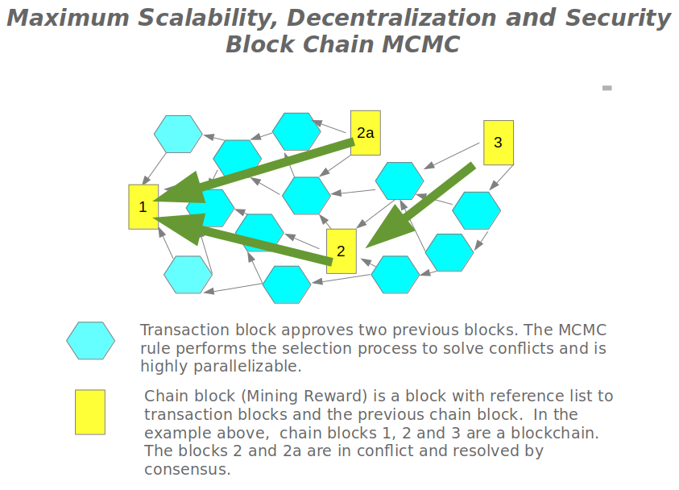

# Cryptocurrency, Payment,Asset，Exchange, and Web3 Platform

BigTangle is a cryptocurrency network extending the blockchain with help of Markov Chain Monte Carlo (MCMC). The consensus algorithm is initially Proof-of-Work and will be migrated to Proof-of-Stake. 

Through the use of industry-standard technology in conjunction with a parallelizable architecture, BigTangle positions itself as a successor to Bitcoin and Ethereum, with blockchain and smart contracts representing its special use cases.

BigTangle focuses on economically important key use-cases, supporting custom token issuances, market transactions, exchanges, mining activities, and contracts.

## Key Features

- **Ease of Use:** BigTangle emphasizes user-friendly interfaces.
- **Near-Time Confirmation:** Transactions are confirmed promptly.
- **Infinite Scalability:** The platform can scale without limitations.
- **Permissionless:** Open access for all participants.
- **Trustless:** Decentralized without the need for trust.
- **Decentralized Proof of Work:** Distributes the proof-of-work mechanism.
- **Constant Total Coin:** Maintains a consistent coin supply.
- **Quantum Security:** Incorporates measures for quantum resistance.

## Payment

By providing scalable infrastructure, BigTangle allows the global transaction volume to be processed on a single network. This offers infrastructural cost advantages by eliminating the complex, costly processes of traditional payment processing.

## Fiat Money

For banks and central banks, the token issuance protocol can be used to issue bank-backed tokens denoting conventional fiat money. Fiat money transactions can then feasibly be processed within seconds on a worldwide scale.

## Decentralized Exchange

BigTangle operates as a decentralized exchange with integrated markets for various assets such as stocks and bonds. Creating new token equivalents makes it easy for companies to issue stocks on the BigTangle network. Existing stock markets can seamlessly integrate with BigTangle as a back-end, providing a comprehensive and decentralized trading environment.

 Blockchain with MCMC  

## White paper <https://github.com/bigtangle/whitepaper/bigtangle.pdf>

## Source for Android App <https://github.com/bigtangle/bigtangle-app>

## [Chinese (中文)](/zh/readme.md)