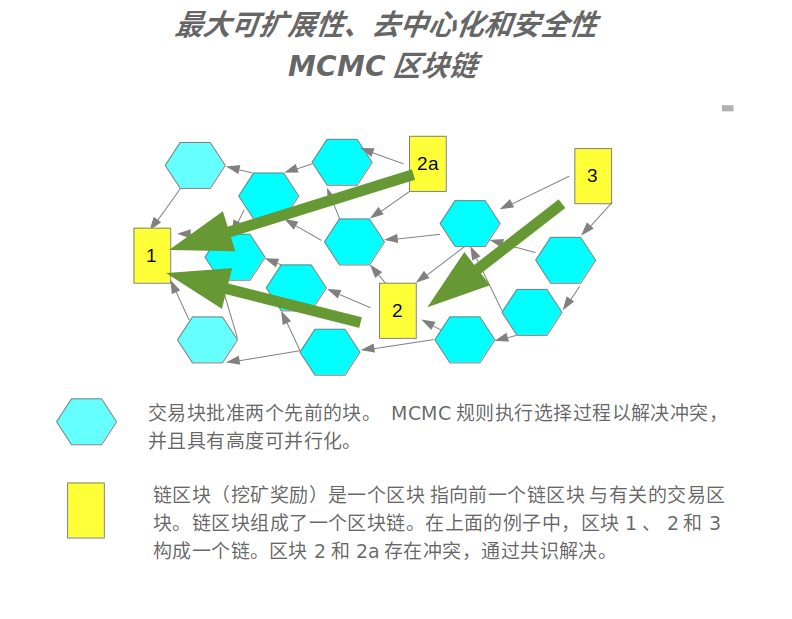

# 加密货币、支付、资产、交易和Web3平台

大网(BigTangle)是一个加密货币网络，通过马尔可夫链蒙特卡洛（MCMC）的帮助扩展区块链。共识算法采用工作证明（Proof-of-Work)。区块链形成共识，其中每个形成链的区块包含引用对其他类型交易区块的表。可并行处理的交易区块遵循MCMC规则。这种新协议具有高度可并行化、可扩展和快速的特点。
 区块链MCMC 
通过使用标准技术与可并行化的架构相结合，大网(BigTangle)为比特币和以太坊的继任者，区块链 Bitcoin 和智能合约Ethereum代表特殊用例。

大网(BigTangle)专注于经济重要的关键用例，支持自定义代币发行、交易、交易所、挖矿活动和合约。

## 主要特点

- **易用性：** 大网(BigTangle)强调用户友好的界面。
- **近实时确认：** 交易迅速确认。
- **高可扩展性：** 该平台可以无限制地扩展。
- **无权限：** 开放给所有参与者的无限制访问。
- **无信任：** 分散无需信任。
- **分散式工作证明：** 分发工作证明机制。
- **恒定总币和费用：** 保持恒定的总币和交易区块的费用。收取的费用是挖矿奖励。

## 支付和交易

通过提供可扩展的基础设施，大网(BigTangle)允许全球在单个网络上处理支付和交易。通过消除传统支付处理的复杂、昂贵过程，提供基础设施优势。

## 资产和法定货币

对于银行和中央银行，数字资产发行协议可用于发行以传统法定货币和资产为代表的数字资产。法定货币交易可以在全球范围内在几秒钟内进行处理。

## 去中心化交易所

大网(BigTangle)运作为一个去中心化交易所，各种资产的市场，如股票和债券。创建新的代币等价物使公司能够在大网(BigTangle)网络上发行股票变得容易。现有的股票市场可以无缝集成大网(BigTangle)作为后端，提供全面的去中心化交易所。

## Web3

大网(BigTangle)实现去中心化彩票，通证跨链, 数字身份证, 提供Web服务和存储。

## 
## 服务器节点应用源代码 <https://github.com/bigtangle/bigtangle-app>
## Android应用源代码 <https://github.com/bigtangle/bigtangle-app>
## 白皮书 <https://github.com/igtangle/whitepaper/bigtangle.pdf>